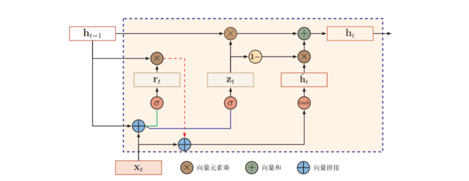

[TOC]

# 数据挖掘Project

## 摘要

## 1. 概述/引言

### 1.1 研究文本情感分析的背景和意义

文本情感分析是自然语言处理领域文本分类方向的一个重要分支，也可以被称为意见挖掘。简而言之，文本的情感分析就是对带有情感色彩的主观性文本进行分析、处理、归纳和推理的过程。

在情感分析中，按照处理文本的粒度不同，可分为词语短语级、句子级、篇章级等几个研究层次。在情感分析处理过程中，可以认为构成文本的基本单位包括词、短语、和固定搭配，对于它们的褒贬程度的度量是判别文本情感倾向的基础，而将这些词、短语、固定搭配结合成完整句子之后结合语境进行深层次的情感划分，是情感分类针对具体问题建模处理后要达成的目的。

基于现实基础，在文本情感分析过程中，机器通过了解到到不同人群对某个实体所持的观点、态度、情感，在大批量文本处理过后，给出对应反馈，进而可帮助从业人员在未来提高相关的服务或产品质量，改进某方面的缺陷是进行文本情感分类要达成的一个重要目的。

### 1.2 问题描述

基于 1. 1 的分析，可以明确进行情感分析需要解决的问题如下：

1) 获得可用的数据集样本，按比例将数据集划分为训练集、验证集、测试集，且数据集至少需要包括两列的属性：文本、情感极性

2) 创建训练模型，分批量使用训练集、验证集完成对模型的训练

3) 使用已训练模型对测试集进行预测，分析对应模型下情感分类的准确率与模型的优缺点

### 1.3 本文的工作

从 1.2 知本文需要进行的工作可以归为三方面：

1). 获取数据集：

1.1 已经阐述了文本的情感分析的现实意义，但是提取某服务业所包含的信息并进行人工进行情感的标注进而创建出可用的数据集是一项工作量十分庞大的任务，同时由于各类型服务网站信息的加密导致可以进行处理的文本并不容易被获得到，且某些句子再被人工进行分类时候容易受标记者主观情感的影响，所以论文选用的数据集来自代表性较强的[crowdflower航空客户满意调查](<https://www.crowdflower.com/wp-content/uploads/2016/03/Airline-Sentiment-2-w-AA.csv>)；

2). 建立模型完成训练：

基于深度学习方向的解题思路，首先提取数据集的特征，随后建立有监督的训练模型，本论文所涉猎的模型有：朴素贝叶斯、线性支持向量机、K-近邻等传统算法，以及TextCNN、RNN（LSTM、GRU）等深度学习模型。

3). 总结与展望

最后，我们总结了论文中使用到的模型的特性，比较了模型之间的准确性，并基于已完成的工作对未来的发展进行了展望。

### 1.4 论文结构简介

1) 论文第一部分介绍文本情感分析问题的背景，这部分对文本情感分析问题的背景与研究意义进行了简要分析，同时对本文要完成的工作进行了介绍，包括建模方法与数据集来源；

2) 论文第二部分介绍文章中涉及的建模方法，这部分对 1.3 中提及的建模方法进行了详细的扩充以及优缺点分析，为论文第四部分训练结果的评估提供有效的理论依据；

3) 论文第三部分介绍设计实验的过程，这部分对数据集的预处理、训练模型的搭建、超参数的设定、模型的训练等进行实现，为论文第四部分训练结果的评估提供有限的数据支持；

4) 论文第四部分介绍实验的结果，这部分对不同模型得到的结果进行对比与分析，同时深层次（包括时间利用率、空间利用率）对相应模型的优缺点进行归纳；

5) 论文第五部分是文章的总结与对未来文本情感分析发展的展望，这部分对文章完成的工作与解决的问题进行总结，同时也基于已完成的工作与当下情感分类问题的发展趋势对未来进行展望；

6) 论文第六部分是组内成员的自评与互评部分，这部分是每个人对自己本次论文中所完成的任务的总结以及对其他组员在本次论文中表现的评价。

## 2. 相关工作综述

### 2.1 文本情感分类相关发展

随着社交网络的发展，2010年，以twitter为语料库，Alexander Pak, Patrick Paroubek利用 n-gram 算法进行了情感分析和意见挖掘。他们构建了一个情感分类器，能够为文档确定积极，消极和中立的情感。实验评估表明，他们提出的技术是有效的，并且比先前提出的方法表现更好。在该研究中语言为英语，但是所提出的技术可以与任何其他语言一起使用。2011年，Maite Taboada 和 Manfred Stede 等人提出语义定向计算器（SO-CAL）， 利用词语的情感强度以及情感加强和否定规则判断篇章的情感极性。

基于神经网络的语义组合算法被验证是一种非常有效的特征学习手段，2013年，Richard Socher和Christopher Potts等人提出多个基于树结构的Recursive Neural Network，该方法通过迭代运算的方式学习变量长度的句子或短语的语义表示，在斯坦福情感分析树库（Stanford Sentiment Treebank）上验证了该方法的有效性。Nal Kalchbrenner等人描述了一个卷积体系结构，称为动态卷积神经网络（DCNN），他们采用它来进行句子的语义建模。 该网络使用动态k-Max池，这是一种线性序列的全局池操作。 该网络处理不同长度的输入句子，并在句子上引入能够明确捕获短程和长程关系的特征图。 网络不依赖于解析树，并且很容易适用于任何语言。该模型在句子级情感分类任务上取得了非常出色的效果。

2015年，Kai Sheng Tai，Richard Socher, Christopher D. Manning在序列化的LSTM （Long Short-Term Memory）模型的基础上加入了句法结构的因素，该方法在句法分析的结果上进行语义组合，在句子级情感分类和文本蕴含任务(text entailment)上都取得了很好的效果。

2016年，Qiao Qian, Xiaoyan Zhu等人在LSTM和Bi-LSTM模型的基础上加入四种规则约束，利用语言资源和神经网络相结合来提升情感分类问题的精度。

2017年， Lotem Peled、Roi Reichart尝试提出了简单的语句级标注模型，并尝试对情感词典、否定词和强度词的语言作用进行建模。结果表明，该模型能较好地反映情感词、否定词和强度词在情感表达中的语言作用。

2018年， Wei Xue, Tao Li等人提出了一种基于卷积神经网络和门控机制的模型，根据给定的方面或实体选择性地输出情感特征。该体系结构比现有模型中使用的注意层简单得多。其次，由于卷积神经网络没有时间依赖的特性，该模型计算可以在训练期间轻松并行化，并且门控单元也可以独立工作。

### 2.2 朴素贝叶斯分类

### 2.3 聚类

### 2.3 线性模型

### 2.4 因子分解机

在传统的机器学习算法中，对自变量文本的处理都是先将其转为 One-Hot 向量，随后传入对应模型进行训练，但是训练集文本经过 One-Hot 编码之后，大部分 One - Hot 向量是比较稀疏的，也即每个 n 维特征，仅存在部分维度特征具有非零值的情况，一定程度上降低了空间利用率，并且原训练集数据特征与特征之间的关联程度无法被准确表示，比如当 n-gram = 1时候，对于短语 `in the morning` 会被拆分为三个单词，也就了失去原本应用的含义。

因子分解机（Factorization Machine，简称FM），又称分解机。是由德国康斯坦茨大学的Steffen Rendle（现任职于Google）于2010年最早提出的，旨在解决大规模稀疏数据下的特征组合问题，二阶FM 的表达式为：
$$
y(x)=w_0+\sum_{i=1}^nw_ix_i+\sum_{i=1}^n\sum_{j=i+1}^nw_{ij}x_ix_j
$$
其中，$n$ 代表样本的特征数量，$$x_i$$ 第 $$i$$ 个特征的值，$$w_0、w_i、w_{ij}$$ 是模型的参数。

然而，在数据稀疏性普遍存在的实际应用场景中，二次项参数的训练是很困难的。其原因是，回归模型的参数 $$w$$ 的学习结果就是从训练样本中计算充分统计量（凡是符合指数族分布的模型都具有此性质），而在这里交叉项的每一个参数 $$w_{ij}$$ 的学习过程需要大量的 $$x_i$$ 、$$x_j$$ 同时非零的训练样本数据。由于样本数据本来就很稀疏，能够满足 $$x_i$$ 和 $$x_j$$ 都非零的样本数就会更少。训练样本不充分，学到的参数 $$w_{ij}$$ 就不是充分统计量结果，导致参数 $$w_{ij}$$ 不准确，而这会严重影响模型预测的效果和稳定性，所以为了解决二次项训练的问题，引入了矩阵分解的思想，也即将所有二次项参数 $$w_{ij}$$ 组成一个对称矩阵 $$W$$ 那么这个矩阵就可以分解为 $$W=V^TV$$，$$V$$ 的第 $$j$$ 列便是第 $$j$$ 维特征的隐向量，也即每个参数 $$w_{ij}=⟨v_i,v_j⟩$$，所以原 FM 表达式可以写成：
$$
y(x)=w_0+\sum _{i=1}^nw_ix_i+\sum_{i=1}^n\sum_{j=i+1}^n⟨v_i,v_j⟩x_ix_j
$$
其中，$$v_i​$$  是第 $$i​$$ 维特征的隐向量，$$⟨⋅,⋅⟩​$$ 代表向量点积，计算公式为：
$$
⟨v_i,v_j⟩=\sum_{f=1}^kv_{i,f}·v_{j,f}
$$
隐向量的长度为 $$k(k<<n)$$，包含 $$k$$ 个描述特征的因子，表达式前两项是线性回归模型的表达式，最后一项是二阶特征交叉项（又称组合特征项），表示模型将两个互异的特征分量之间的关联信息考虑进来，用交叉项表示组合特征，从而建立特征与结果之间的非线性关系；

FM 可以提升 One-Hot 向量特征之间的关联性，交叉项 $$⟨v_i,v_j⟩$$ 可以表示第 $i$ 项与第 $$j$$ 项之间的关联关系，如果交叉项结果为 0 ，则表示其没有关联关系，这样可以大大降低模型预测的错误率，提升模型的预估能力；

### 2.5 LSTM

#### 2.5.1 LSTM 简介

$$LSTM(Long Short-Term Memory)$$，也即长短记忆网络，是循环神经网络的一个变体，可以有效的解决简单循环神经网络中的梯度消失或者梯度爆炸的问题。

$$LSTM$$ 引入一个新的内部状态 $$c_t$$ 专门进行线性的循环信息传递，同时输出信息给隐藏层的外部状态 $$h_t$$ ，$$LSTM$$ 的新计算方式为：
$$
\begin{aligned} \mathbf{c}_{t} &=\mathbf{f}_{t} \odot \mathbf{c}_{t-1}+\mathbf{i}_{t} \odot \tilde{\mathbf{c}}_{t} \\ \mathbf{h}_{t} &=\mathbf{o}_{t} \odot \tanh \left(\mathbf{c}_{t}\right) \end{aligned}
$$
其中$$f_t，i_t，o_t$$ 为三个门来控制信息传递的路径；$$\odot$$ 为向量元素乘积；$$c_{t-1}$$ 为上一时刻的记忆单元；$$\tilde{\mathbf{c}}_{t}$$ 是通过非线性函数得到的候选状态，其计算方法为：
$$
\tilde{\mathbf{c}}_{t}=\tanh \left(W_{c} \mathbf{x}_{t}+U_{c} \mathbf{h}_{t-1}+\mathbf{b}_{c}\right)
$$
在每个时刻 $$t$$，$$LSTM$$ 网络的内部状态 $$c_t$$ 记录了当前时刻为止的历史信息；

同时，$$LSTM$$ 引入了三个门，其分别为：

- 遗忘门 $$f_t$$ 控制上一个时刻的内部状态 $$c_{t-1}$$ 需要遗忘多少信息；
- 输入门 $$i_t$$ 控制当前时刻的候选状态 $$\tilde{\mathbf{c}}_{t}$$ 有多少信息需要保存；
- 输出门 $$o_t$$ 控制当前时刻的内部状态 $$c_t$$ 有多少信息需要输出给外部状态 $$h_t​$$ ； 

三个门的计算方式为：
$$
\begin{aligned} \mathbf{i}_{t} &=\sigma\left(W_{i} \mathbf{x}_{t}+U_{i} \mathbf{h}_{t-1}+\mathbf{b}_{i}\right) \\ \mathbf{f}_{t} &=\sigma\left(W_{f} \mathbf{x}_{t}+U_{f} \mathbf{h}_{t-1}+\mathbf{b}_{f}\right) \\ \mathbf{o}_{t} &=\sigma\left(W_{o} \mathbf{x}_{t}+U_{o} \mathbf{h}_{t-1}+\mathbf{b}_{o}\right) \end{aligned}
$$
其中，$$\sigma(·)$$ 为 $$Logistic$$ 函数，$$x_t$$ 为当前时刻的输入，$$h_{t-1}$$ 为上一时刻的外部状态； 

#### 2.5.2 LSTM 的计算过程

$$LSTM$$ 循环单元结构的计算过程如下： 

- 利用上一时刻的外部状态 $$h_{t-1}$$ 和当前时刻的输入 $$x_t$$ ，计算出三个门，以及候选状态
  $$\tilde{\mathbf{c}}_{t}$$
- 结合遗忘门 $$f_t$$ 和输入门 $$i_t$$ 来更新记忆单元 $$c_t$$
- 结合输出门 $$o_t$$，将内部状态的信息传递给外部状态 $$h_t​$$ 

转化为图示为：

### 2.6 GRU

#### 2.6.1 GRU 简介

门控循环单元（Gated Recurrent Unit， GRU）网络是一种比 LSTM 网络更加简单的循环神经网络; 和 LSTM 不同， GRU 不引入额外的记忆单元， GRU 网络引入一个更新门（Update Gate）来控制当前状态需要从历史状态中保留多少信息（不经过非线性变换），以及需要从候选状态中接受多少新信息，所以当前状态 $h_t$ 的更新过程可以记为 ：
$$
\mathbf{h}_{t}=\mathbf{z}_{t} \odot \mathbf{h}_{t-1}+\left(1-\mathbf{z}_{t}\right) \odot g\left(\mathbf{x}_{t}, \mathbf{h}_{t-1} ; \theta\right)
$$
其中 $\mathbf{z}_{t} \in[0,1]$ 为更新门，其表达式为：
$$
\mathbf{z}_{t}=\sigma\left(\mathbf{W}_{z} \mathbf{x}_{t}+\mathbf{U}_{z} \mathbf{h}_{t-1}+\mathbf{b}_{z}\right)
$$
在 LSTM 网络中，输入门和遗忘门是互补关系，具有一定的冗余性；GRU网络直接使用一个门来控制输入和遗忘之间的平衡。

#### 2.6.2 GRU 计算过程

从 $$h_t$$ 表达式中可知，当 $$z_t = 0$$时，当前状态 $$h_t$$ 和前一时刻的状态 $$h_{t-1}$$ 之间为非线性函数关系；当$$z_t = 1$$ 时， $$h_t$$ 和 $$h_{t-1}$$ 之间为线性函数关系；

在 GRU 网络中， 函数 $g\left(\mathbf{x}_{t}, \mathbf{h}_{t-1} ; \theta\right)$ 定义为:
$$
\tilde{\mathbf{h}}_{t}=\tanh \left(W_{h} \mathbf{x}_{t}+U_{h}\left(\mathbf{r}_{t} \odot \mathbf{h}_{t-1}\right)+\mathbf{b}_{h}\right)
$$
其中 $\tilde{\mathbf{h}}_{t}$ 表示当前时刻的候选状态， $$\mathbf{r}_{t} \in[0,1]$$ 为重置门，用来控制候选状态 $\tilde{\mathbf{h}}_{t}$ 的计算是否以来上一时刻的状态 $h_{t-1}$ ，其中 $$r_t$$ 的表达式为：
$$
\mathbf{r}_{t}=\sigma\left(W_{r} \mathbf{x}_{t}+U_{r} \mathbf{h}_{t-1}+\mathbf{b}_{r}\right)
$$
当 $$r_t = 0$$ 时，候选状态 $$\tilde{\mathbf{h}}_{t}=\tanh \left(W_{c} \mathbf{x}_{t}+\mathbf{b}\right)$$ 只和当前输入 $x_t$ 相关，和历史状态无关；当 $$r_t = 1$$ 时，候选状态 $$\tilde{\mathbf{h}}_{t}=\tanh \left(W_{h} \mathbf{x}_{t}+U_{h} \mathbf{h}_{t-1}+\mathbf{b}_{h}\right)$$ 和当前输入 $$x_t$$ 和历史状态 $$h_{t-1}$$ 相关，和简单循环网络一致;

以上计算过程可转化为图示：

### 2.7 TextCNN 

卷积神经网络 (CNN) 是神经网络和卷积操作的结合，在卷积神经网络结构中，神经网络可以学习显式特征和隐藏特征之间的关系，卷子算子可以捕获特征中的局部区域信息。TextCNN作者针对一般文本分类任务，提出了一种具有两个通道和多个滤波器的CNN 网络，其结构如图：

TextCNN 第一层是输入层，对于每个句子或者段落，通过分词之后，将原句子按照顺序进行 word2vec 操作（这里可使用谷歌预训练向量，也可以规定最大长度随机生成向量），随后将这些词向量拼接生成特征矩阵，该特征矩阵每一行以相同的顺序对应于句子中的单词；第二层是卷积层，使用不同尺寸的多个滤波器对输入层进行卷积操作，在该层中，滤波器的长度要与特征向量的长度一致；第三层是随时间变化的最大池化层，该图层不会在上一层得到的局部向量中直接取最大值，而是对整个卷积层的结果取最大值；第四层是具有 sigmoid 函数的全连通隐藏层；第五层是具有 softmax 输出的全连接层。

TextCNN 的思想是：使用卷积层来捕获单词之间的局部特征（类似于 N-gram），使用两个全连接层来学习适合特定分类任务的高级特征，以及使用池化层防止过拟合操作与处理不同长度的文本数据。

## 3. 完成文本情感分析的方法

### 3.1 基于深度学习的文本情感分析的问题描述

### 3.2 逐步完成算法

#### 3.2.1 训练数据集的处理以及构建训练batch

#### 3.2.2 模型的搭建

#### 3.2.3 模型训练

## 4. 仿真/实验结果与分析

### 4.1 数据集

### 4.2 评价

#### 4.2.1 评价标准

#### 4.2.2 结果

#### 4.2.3 随机输入句子进行测试

## 5. 总结与展望

### 瓶颈

- 现在的情感分析工作已经能够完成一些简单的任务，并表现出机器具有识别人类情感的能力，但是这些任务的复杂度还不足以与实际应用中任务的复杂度匹配。
- 情感分析的研究需要词典资源的支持，特别是在中文领域，目前的词典的质和量都还有提高的空间，并且还需要更多的主客观词典.
- 在情感表达形式上，人们对于情感的表达也多样化的，有直截了当的，也有含蓄不露的，更有通过修辞手段及反讽的多种形式表达情感，因此需要更深层次的机器学习技术以及情感常识库的支持，如何构建常识知识库是亟待解决的问题。

### 未来发展方向

- 在情感研究对象上，随着应用领域的不断扩展，情感对象从之前的对产品、服务等的褒贬倾向性评论到对社交媒体中的用户、话题情绪分类，表现形式更加多样，情感种类更加繁多，研究的内容也会发生相应转变，包括更加关注用户的信息以及针对社交媒体中事件用户情感的变迁。
- 在情感分析学习算法上，深度学习的崛起，无疑也为情感分析中的许多任务提供了良好的工具，并在一些任务上初现端倪，随着情感分析研究不断扩展和深入，会发挥更多的作用。
- 从认知科学角度，情感分析是人工智能的一部分，虽然尚不能完全了解人类情感产生的机理，但是可以和认知科学研究者开展合作研究，通过观察脑电波探知产生各种情感的脑波形和反射情况，为情感分析研究提供科学依据。
- 在情感分析应用上，情感分析和人工智能结合，将产生一系列的应用，在聊天机器人中识别用户情感，并给予情感抚慰。更进一步，未来情感分析应用于对文章及诗词的鉴赏，自动生成自己的观点、立场及情绪，表达机器自身的情感，从而向强人工智能迈进。

## 参考文献

## 致谢

